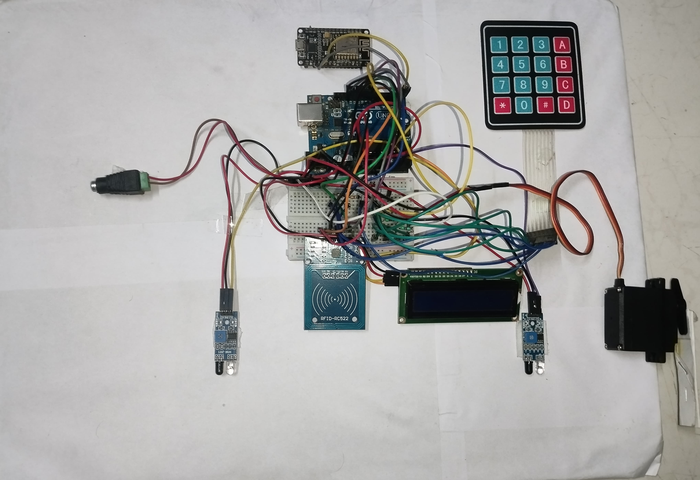

# IoT-Based Automatic Toll Collection System

## Description
This project is a prototype of an automated toll collection system designed to reduce traffic congestion and streamline the payment process at toll plazas. It uses RFID (Radio-Frequency Identification) technology to uniquely identify vehicles and automatically deduct a fixed toll amount from a hardcoded prepaid balance associated with the RFID card.

A key feature of this system is an IoT-based recharge portal. An ESP8266 module hosts a Wi-Fi access point and a web page, allowing an operator to remotely recharge a user's card balance by sending the card's UID and a recharge amount to the main Arduino controller via serial communication.

## Key Features
* **Automated Vehicle Detection:** Two IR sensors are used to detect a vehicle's arrival at the toll booth and its subsequent departure.
* **RFID Authentication:** An MFRC522 RFID reader scans a vehicle's tag to authenticate it against a predefined list of valid UIDs. Unauthorized vehicles are denied access and trigger a buzzer.
* **Automatic Toll Deduction:** For authenticated vehicles, a fixed toll amount is automatically deducted from their prepaid balance stored on the Arduino.
* **On-Site Balance & Recharge:** If a vehicle has insufficient balance, it is prompted to recharge. An operator can use an attached keypad or a web portal to enter the recharge amount.
* **Web-Based Recharge Portal:** An ESP8266 hosts a Wi-Fi access point (`ESP_Recharge`) and a web page. This allows an administrator to connect to the ESP8266, enter a card's UID and a recharge amount, and submit it to the Arduino to update the balance.
* **Physical Barrier Control:** A servo motor simulates a real-world boom barrier, opening for authorized vehicles and closing after they pass.
* **User Feedback:** A 16x2 I2C LCD provides real-time instructions and status updates to the driver (e.g., "Welcome," "Please Recharge," "Access Denied").

## Technologies Used
### Hardware
* **Main Controller:** Arduino UNO
* **Web Portal/Wi-Fi:** ESP8266
* **Vehicle Identification:** MFRC522 RFID Reader & RFID Cards
* **Vehicle Detection:** 2x IR Proximity Sensors
* **User Input:** 4x4 Matrix Keypad (via OnewireKeypad library)
* **Actuators:** Servo Motor (for boom barrier), Buzzer (for alerts)
* **Display:** 16x2 I2C Liquid Crystal Display

### Software
* **Platform:** Arduino IDE
* **Languages:** C++
* **Key Libraries:** `MFRC522.h`, `Servo.h`, `LiquidCrystal_I2C.h`, `OnewireKeypad.h`, `ESP8266WiFi.h`, `ESP8266WebServer.h`

## System Workflow
1.  **Vehicle Arrival:** An IR sensor detects an approaching vehicle. The LCD prompts the driver to present their RFID card.
2.  **Card Scan:** The driver presents their RFID card to the MFRC522 reader.
3.  **Authentication & Balance Check:** The Arduino reads the card's UID and checks it against its internal database (`"B3 78 9C F6"` and `"33 42 39 C5"`).
    * **If Authorized & Sufficient Balance:** The toll is deducted, the LCD shows a success message, the buzzer beeps once, and the servo motor opens the gate. The system then waits for the second IR sensor to detect the vehicle has passed before closing the gate.
    * **If Authorized & Insufficient Balance:** The LCD displays an "Insufficient Balance" message and prompts for a recharge. The gate remains closed.
    * **If Unauthorized:** The LCD displays "Access Denied," and the buzzer sounds to alert the operator.
4.  **Recharge Process (Web Portal):**
    * An operator connects to the "ESP_Recharge" Wi-Fi network.
    * They navigate to the ESP8266's IP address (192.168.4.1) in a web browser.
    * A form appears asking for the card's UID and a recharge amount.
    * Upon submission, the ESP8266 sends this data as a comma-separated string (e.g., `"B3 78 9C F6,1000"`) to the Arduino via Serial.
    * The Arduino receives this data and updates the corresponding card's balance.

## Circuit Diagram / Photos

**(Add a clear photo of your physical setup or a circuit diagram here)**

